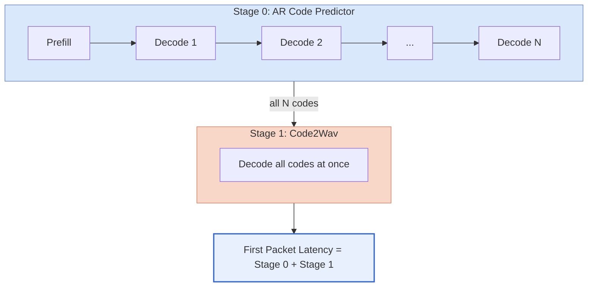
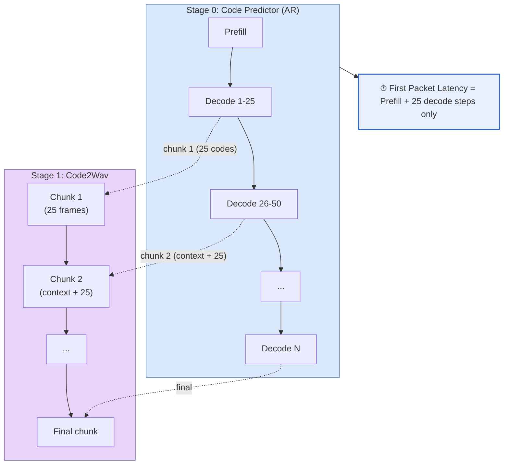

# Adding a TTS Model

This guide walks through adding a new TTS model to vLLM-Omni. Two patterns are
supported:

- **Two-stage pipeline** (e.g. Qwen3-TTS, Fish Speech): an AR code-predictor stage
  feeds an audio decoder stage via the `async_chunk` framework. This is the standard
  pattern for maximum streaming performance.
- **Single-stage AR model** (e.g. MOSS-TTS-Nano): the model runs entirely inside one
  AR worker and streams audio chunks directly from its own `inference_stream()` generator.

Qwen3-TTS is used as the reference for the two-stage pattern. For the single-stage
pattern, refer to MOSS-TTS-Nano.

## Table of Contents

1. [Overview](#overview)
2. [Cross-Cutting Invariants](#cross-cutting-invariants)
3. [Directory Structure](#directory-structure)
4. [Step-by-Step Implementation](#step-by-step-implementation)
5. [Key Components](#key-components)
6. [Model Registration](#model-registration)
7. [Stage Configuration](#stage-configuration)
8. [Stage Input Processors](#stage-input-processors)
9. [Online Serving Integration](#online-serving-integration)
10. [Single-Stage Models](#single-stage-models)
11. [Testing](#testing)
12. [Pre-commit and DCO](#pre-commit-and-dco)
13. [Summary](#summary)

## Cross-Cutting Invariants

These rules apply to every TTS model regardless of architecture (AR vs AR+diffusion,
single-stage vs two-stage, codec-based vs VAE-based). Each has surfaced as a silent
bug in a shipped PR — check them at the end of every phase, not just at the start.

**I1. Streaming output contract.** Pick one per-step semantics for `forward()` and
document it in the docstring:

- *Delta*: yield only new audio samples produced this step. Preferred — linear cost.
- *Cumulative*: re-decode from step 0 every call. O(N²); only acceptable when the
  codec exposes no streaming decode.

If you choose delta, audit the full chain: `forward()` returns the new chunk →
`_consolidate_multimodal_tensors()` in `vllm_omni/engine/output_processor.py`
concatenates the audio key into a single tensor at finish → streaming consumers
receive per-step chunks, offline consumers receive the concatenated tensor. A
mismatch (consolidator skips the key with `continue`, or consumers expect a list
but receive a tensor) is invisible in offline RTF benchmarks — users hear replays
or truncation only under live playback.

**I2. Multimodal output consumer hygiene.** `outputs[0].outputs[0].multimodal_output[key]`
can be `Tensor`, `list[Tensor]` (pre-consolidation snapshot), `np.ndarray`, or
scalar. In every test, example, and benchmark:

- Never write `dict.get("a") or dict.get("b")` on tensor values — Python evaluates
  the tensor's truthiness and raises `Boolean value of Tensor with more than one
  value is ambiguous`. Use explicit `if x is None` chains.
- Defensively handle the list form:
  `if isinstance(x, list): x = torch.cat([t.reshape(-1) for t in x], dim=0)`.
- Assert `shape` / `dtype` / `duration` explicitly — do not rely on truthiness for
  presence checks.

**I3. Hot-loop GPU discipline.** Inside any per-step model loop (AR decode,
diffusion solver, CFM Euler step, per-frame vocoder):

- No `tensor.item()`, `.cpu()`, or `.tolist()` — each triggers a GPU→CPU sync; a
  10-step × 60-frame × 4-op loop creates 2400 syncs per request.
- Prefer `dst.copy_(src)` over `dst.fill_(src.item())` for scalar-into-buffer writes.
- Whole-model `torch.compile(Model.forward, fullgraph=False)` usually outperforms
  per-submodule compile — fewer dispatch boundaries, larger fusion regions. Measure
  before choosing granularity.
- No Python control flow that depends on tensor values; use `torch.where` or masking.

Profile before optimizing.

**I4. Validation pyramid.** Offline RTF alone is necessary but not sufficient. A
new TTS model must pass all three levels:

| Layer | Catches | Tool |
|-------|---------|------|
| Offline RTF / duration | Throughput regressions, missing audio, wrong sample rate | `end2end.py`, pytest e2e |
| Browser streaming playback | Delta-vs-cumulative bugs, chunk boundary glitches, TTFP regressions | Gradio demo over `/v1/audio/speech?stream=true` |
| Concurrent requests | Per-request state leaks, codec window round-robin gaps | `max_num_seqs>1` smoke with 4+ parallel prompts |

**I5. Per-request state belongs to the request.** If the model caches anything
across `forward()` calls (streaming generators, codec buffers, sliding-window pads,
CUDA graph state), key it by `info.get("_omni_req_id")` and free the entry on
request finish. A shared buffer silently corrupts audio across concurrent requests —
the symptom is crosstalk or truncation under load, nothing in single-request tests.

## Overview

vLLM-Omni supports TTS models as multi-stage pipelines where each stage runs independently
and can be placed on different devices. Qwen3-TTS has two stages:

| Stage | Name | Input | Output |
|-------|------|-------|--------|
| 0 | Code Predictor (AR) | Text tokens | Discrete RVQ codec codes |
| 1 | Code2Wav (Decoder) | RVQ codec codes | Audio waveform |

Each stage is a separate model class configured independently via YAML. The two stages
are connected by the `async_chunk` framework, which enables inter-stage streaming for
low first-packet latency (see [Async Chunk Design](../../design/feature/async_chunk.md)).

### Without async_chunk (batch mode)

Stage 0 runs to completion before Stage 1 starts, resulting in long first-packet latency:



### With async_chunk (streaming mode)

Stage 0 sends codec codes to Stage 1 every `chunk_size=25` tokens. Stage 1 begins decoding
immediately, reducing first-packet latency from the full AR time to just the first chunk:



Key parameters: `chunk_size=25`, `left_context_size=25` (validated defaults from Qwen3-TTS
and Qwen3-Omni).

## Directory Structure

When adding a new TTS model, create the following structure:

```
vllm_omni/model_executor/models/
  your_model_name/
    __init__.py
    your_model.py                    # Unified class (stage dispatch)
    your_model_ar_stage.py           # Stage 0: AR stage
    your_model_decoder.py            # Stage 1: audio decoder

vllm_omni/model_executor/stage_input_processors/
  your_model_name.py                 # Stage 0 -> Stage 1 transition

vllm_omni/model_executor/stage_configs/
  your_model_name.yaml               # Batch mode config
  your_model_name_async_chunk.yaml   # Streaming mode config
```

**Qwen3-TTS reference files:**

| File | Purpose |
|------|---------|
| `models/qwen3_tts/qwen3_tts.py` | Unified model class |
| `models/qwen3_tts/qwen3_tts_code_predictor_vllm.py` | Stage 0 - optimized AR |
| `models/qwen3_tts/qwen3_tts_code2wav.py` | Stage 1 - decoder |
| `deploy/qwen3_tts.yaml` (new schema) | Deploy config (async_chunk enabled) — paired with `models/qwen3_tts/pipeline.py` for the frozen topology |

> **Chunked vs end-to-end modes**: `qwen3_tts` registers a single
> pipeline whose stage 1 declares alternate processor functions — an
> `async_chunk_process_next_stage_input_func` (per-chunk streaming, used
> when `deploy.async_chunk=True`) and a `sync_process_input_func`
> (batch-end, used when `deploy.async_chunk=False`). The loader selects
> one at merge time based on the bool, so `--no-async-chunk` alone
> switches modes — no variant yaml or variant pipeline registration is
> needed. Pipelines that only make sense in one mode (e.g.
> `qwen3_omni_moe` is always chunked) can keep using the unconditional
> `custom_process_*` fields.
| `stage_input_processors/qwen3_tts.py` | Stage transition processors |

## Step-by-Step Implementation

### Step 1: Implement Stage 0 - AR Stage

Stage 0 is the autoregressive stage that generates intermediate audio representations.
**It must use vLLM's native decoder layers with fused ops and PagedAttention** for the LLM
backbone - this is the primary source of speedup over HuggingFace inference.

#### 1.1 Use vLLM Decoder Layers Directly

Build your transformer layers from the corresponding vLLM decoder layer class (e.g.
`Qwen3DecoderLayer` for Qwen3-based backbones, or the equivalent for LLaMA, Qwen2, etc.).
Do not wrap the HuggingFace model directly - that bypasses PagedAttention and fused kernels.

```python
# your_model_ar_stage.py

from vllm.model_executor.models.qwen3 import Qwen3DecoderLayer

class YourTTSARStage(nn.Module):

    def __init__(self, config, vllm_config, prefix):
        self.layers = nn.ModuleList([
            Qwen3DecoderLayer(
                config, vllm_config=vllm_config, prefix=f"{prefix}.layers.{i}"
            )
            for i in range(config.num_hidden_layers)
        ])
        self.lm_head = ParallelLMHead(config.codec_size, config.hidden_size)
```

See `qwen3_tts_code_predictor_vllm.py` for the full implementation.

#### 1.2 Forward Pass

Implement `forward()` to return an `OmniOutput` with intermediate data for Stage 1:

```python
def forward(self, input_ids, positions, intermediate_tensors=None,
            inputs_embeds=None, **kwargs) -> OmniOutput:
    hidden_states = self.run_layers(input_ids, positions, intermediate_tensors, inputs_embeds)
    logits = self.lm_head(hidden_states)

    return OmniOutput(
        text_hidden_states=hidden_states,
        multimodal_outputs={
            "audio_codes": self.extract_codes(logits),
        },
    )
```

The keys in `multimodal_outputs` are what your stage input processor will read to build
Stage 1 inputs.

#### 1.3 Weight Loading with Fused QKV

When using vLLM's fused `QKVParallelLinear`, pack the HF `q_proj`/`k_proj`/`v_proj` weights
into `qkv_proj` using `stacked_params_mapping`. See the `load_weights()` method in
`qwen3_tts_code_predictor_vllm.py` for the standard pattern - it can be reused as-is
for any Qwen-family backbone.

#### 1.4 Custom Stop Condition (if needed)

Some TTS models use a learned stop head rather than an EOS token. If your model does this,
implement it inside `sample()`:

```python
def sample(self, logits, sampling_metadata) -> SamplerOutput | None:
    output = self.sampler(logits, sampling_metadata)
    if self._stop_head_fired():
        output = mark_as_finished(output)
    return output
```

### Step 2: Implement Stage 1 - Decoder

Stage 1 decodes Stage 0 output into audio. It runs outside the scheduler (no PagedAttention
needed). Implement `chunked_decode_streaming()` to support async_chunk streaming:

```python
# your_model_decoder.py

class YourTTSDecoder(nn.Module):

    def __init__(self, *, vllm_config: VllmConfig, prefix: str = ""):
        super().__init__()
        # Initialize your audio decoder (SpeechTokenizer, HiFiGAN, etc.)

    def forward(self, codes: torch.Tensor, **kwargs) -> torch.Tensor:
        return self.decoder(codes)

    def chunked_decode_streaming(self, codes, chunk_size=25,
                                  left_context_size=25) -> torch.Tensor:
        """Decode with a sliding context window for smooth chunk boundaries."""
        end_index = codes.shape[-1]
        context_size = 0 if end_index <= chunk_size else left_context_size
        wav_chunk = self(codes)
        # Trim left context to avoid duplicate audio
        return wav_chunk[..., context_size * self.total_upsample:]
```

### Step 3: Implement the Unified Model Class

The unified class dispatches to the correct stage based on `model_stage` in the config:

```python
# your_model.py

class YourTTSModelForConditionalGeneration(nn.Module, SupportsPP):

    def __init__(self, *, vllm_config: VllmConfig, prefix: str = ""):
        super().__init__()
        self.model_stage = vllm_config.model_config.model_stage

        if self.model_stage == "ar_stage":
            ar_vllm_config = vllm_config.with_hf_config(
                vllm_config.model_config.hf_config.ar_config,
                architectures=["YourTTSARStageForConditionalGeneration"],
            )
            self.ar_stage = init_vllm_registered_model(
                vllm_config=ar_vllm_config,
                prefix=maybe_prefix(prefix, "ar"),
                hf_config=ar_vllm_config.model_config.hf_config,
                architectures=["YourTTSARStageForConditionalGeneration"],
            )
            self.model = self.ar_stage

        elif self.model_stage == "decoder":
            self.decoder = YourTTSDecoder(vllm_config=vllm_config, prefix=prefix)
            self.model = self.decoder
```

### Step 4: Create `__init__.py`

```python
# vllm_omni/model_executor/models/your_model_name/__init__.py
from .your_model import YourTTSModelForConditionalGeneration

__all__ = ["YourTTSModelForConditionalGeneration"]
```

## Key Components

### Model Interfaces

Your unified model class should implement the appropriate interfaces:

- **`SupportsPP`**: Required for pipeline parallelism support (all models should implement this)
- **`SupportsMultiModal`**: Only if your model accepts multimodal inputs (e.g. reference audio for voice cloning)

### Output Format

Use `OmniOutput` so the orchestrator can route intermediate data between stages:

```python
from vllm_omni.model_executor.models.output_templates import OmniOutput

return OmniOutput(
    text_hidden_states=hidden_states,
    multimodal_outputs={
        "audio_codes": codec_codes,
    },
)
```

### Weight Loading from a Single Checkpoint

If both stages load from one checkpoint, separate them by prefix in the unified class:

```python
def load_weights(self, weights: Iterable[tuple[str, torch.Tensor]]) -> set[str]:
    ar_weights, decoder_weights = [], []
    for name, tensor in weights:
        if name.startswith("decoder."):
            decoder_weights.append((name, tensor))
        else:
            ar_weights.append((name, tensor))

    if self.model_stage == "ar_stage":
        return self.ar_stage.load_weights(ar_weights)
    elif self.model_stage == "decoder":
        return self.decoder.load_weights(decoder_weights)
```

## Model Registration

Register all stage classes in `vllm_omni/model_executor/models/registry.py`:

```python
_OMNI_MODELS = {
    # (package_name, module_name, class_name)
    "YourTTSModelForConditionalGeneration": (
        "your_model_name", "your_model",
        "YourTTSModelForConditionalGeneration",
    ),
    "YourTTSARStageForConditionalGeneration": (
        "your_model_name", "your_model_ar_stage",
        "YourTTSARStageForConditionalGeneration",
    ),
    "YourTTSDecoder": (
        "your_model_name", "your_model_decoder",
        "YourTTSDecoder",
    ),
}
```

The registry uses lazy loading - model classes are only imported when needed.

## Stage Configuration

Each stage has a `worker_type` that determines how it is scheduled:

- `worker_type: ar` - autoregressive stage, uses `OmniARScheduler` with PagedAttention
- `worker_type: generation` - non-AR stage (e.g. decoder), uses `OmniGenerationScheduler`

Key configuration fields:

| Field | Description |
|-------|-------------|
| `model_stage` | Which stage to initialize (`ar_stage`, `decoder`, etc.) |
| `model_arch` | Architecture name, must match `registry.py` |
| `engine_input_source` | List of upstream stage IDs that provide input (e.g. `[0]`) |
| `engine_output_type` | Output type: `latent` for intermediate, `audio` for final |
| `custom_process_next_stage_input_func` | Async chunk processor function path (streaming only) |
| `final_output` | Whether this stage produces the final user-facing output |
| `final_output_type` | Type of final output (`audio`, `text`, etc.) |

### Batch mode

```yaml
# stage_configs/your_model_name.yaml

stage_args:
  - stage_id: 0
    stage_type: llm
    runtime:
      devices: "0"
    engine_args:
      model_stage: ar_stage
      max_num_seqs: 64
      model_arch: YourTTSModelForConditionalGeneration
      worker_type: ar
      scheduler_cls: vllm_omni.core.sched.omni_ar_scheduler.OmniARScheduler
      engine_output_type: latent
    default_sampling_params:
      temperature: 0.9
      top_k: 50
      max_tokens: 2048

  - stage_id: 1
    stage_type: llm
    runtime:
      devices: "0"
    engine_args:
      model_stage: decoder
      model_arch: YourTTSModelForConditionalGeneration
      worker_type: generation
      scheduler_cls: vllm_omni.core.sched.omni_generation_scheduler.OmniGenerationScheduler
      engine_output_type: audio
    engine_input_source: [0]
    final_output: true
    final_output_type: audio
```

### Streaming mode (async_chunk)

Add `async_chunk: true` at the top level and specify `custom_process_next_stage_input_func`
on Stage 0 to define how intermediate outputs are chunked and forwarded:

```yaml
# stage_configs/your_model_name_async_chunk.yaml

async_chunk: true

stage_args:
  - stage_id: 0
    stage_type: llm
    runtime:
      devices: "0"
    engine_args:
      model_stage: ar_stage
      max_num_seqs: 64
      model_arch: YourTTSModelForConditionalGeneration
      worker_type: ar
      scheduler_cls: vllm_omni.core.sched.omni_ar_scheduler.OmniARScheduler
      engine_output_type: latent
      custom_process_next_stage_input_func: >
        vllm_omni.model_executor.stage_input_processors.your_model_name.ar2decoder_async_chunk
    default_sampling_params:
      temperature: 0.9
      top_k: 50
      max_tokens: 2048

  - stage_id: 1
    stage_type: llm
    runtime:
      devices: "0"
    engine_args:
      model_stage: decoder
      model_arch: YourTTSModelForConditionalGeneration
      worker_type: generation
      scheduler_cls: vllm_omni.core.sched.omni_generation_scheduler.OmniGenerationScheduler
      engine_output_type: audio
    engine_input_source: [0]
    final_output: true
    final_output_type: audio
```

## Stage Input Processors

Stage input processors convert Stage 0 outputs into Stage 1 inputs. Create yours in
`vllm_omni/model_executor/stage_input_processors/your_model_name.py`.

See `stage_input_processors/qwen3_tts.py` for the full reference implementation.

### Data structures

Understanding what's available in stage outputs:

- `stage_list[source_id].engine_outputs` - list of `EngineCoreOutput` objects
- Each `EngineCoreOutput` has `outputs` - list of `RequestOutput` objects
- Each `RequestOutput` has:
  - `token_ids` - generated token IDs
  - `multimodal_output` - dict with keys matching your model's `OmniOutput.multimodal_outputs`
  - `prompt_token_ids` - original prompt token IDs

### Batch mode (non-streaming)

Collects all Stage 0 outputs and forwards them to Stage 1 in one shot:

```python
def ar2decoder(
    stage_list: list[Any],
    engine_input_source: list[int],
    prompt: OmniTokensPrompt | TextPrompt | None = None,
    requires_multimodal_data: bool = False,
) -> list[OmniTokensPrompt]:
    source_id = engine_input_source[0]
    decoder_inputs = []

    for output in stage_list[source_id].engine_outputs:
        result = output.outputs[0]
        codes = result.multimodal_output["audio_codes"].cpu()
        decoder_inputs.append(
            OmniTokensPrompt(prompt_token_ids=codes.reshape(-1).tolist())
        )

    return decoder_inputs
```

### Streaming mode (async_chunk)

Buffers Stage 0 outputs and forwards a chunk to Stage 1 once `chunk_size` frames
have accumulated. The function signature follows the `OmniChunkTransferAdapter` protocol:

```python
def ar2decoder_async_chunk(
    transfer_manager: Any,
    pooling_output: dict[str, Any] | None,
    request: Any,
    is_finished: bool = False,
) -> dict[str, Any] | None:
    """Forward chunks of AR output to the decoder stage."""
    request_id = request.external_req_id
    finished = bool(is_finished or request.is_finished())

    # Extract and buffer the latest frame
    if isinstance(pooling_output, dict):
        frame = extract_frame(pooling_output)
        if frame is not None:
            transfer_manager.code_prompt_token_ids[request_id].append(
                frame.cpu().tolist()
            )
    elif not finished:
        return None

    # Read chunk config from connector
    chunk_size = 25
    left_context_size = 25

    length = len(transfer_manager.code_prompt_token_ids[request_id])
    if length <= 0:
        if finished:
            return {"codes": [], "finished": torch.tensor(True, dtype=torch.bool)}
        return None

    # Wait until a full chunk is ready (or request is finished)
    chunk_length = length % chunk_size
    if chunk_length != 0 and not finished:
        return None

    # Build context window: left_context + chunk
    context_length = chunk_length if chunk_length != 0 else chunk_size
    end_index = min(length, left_context_size + context_length)
    window = transfer_manager.code_prompt_token_ids[request_id][-end_index:]

    return {
        "codes": torch.tensor(window).transpose(0, 1).reshape(-1).tolist(),
        "left_context_size": max(0, int(end_index - context_length)),
        "finished": torch.tensor(finished, dtype=torch.bool),
    }
```

Key points:
- `transfer_manager` is the `OmniChunkTransferAdapter` that owns the chunk lifecycle
- Each call appends one AR decode step's output; a chunk is emitted every `chunk_size` steps
- The final (possibly partial) chunk is flushed when `is_finished` is true
- `left_context_size` frames of overlap are included for smooth audio boundaries

## Testing

For general testing conventions, see [tests_style.md](../ci/tests_style.md).

Recommended test cases for a new TTS model:

1. **Single request** - verify waveform output shape and sample rate
2. **Batched requests** - verify each request in the batch finishes independently
3. **async_chunk streaming** - verify audio chunks arrive incrementally and decode correctly
4. **Speaker conditioning** (if applicable) - verify different speaker inputs produce different outputs

Reference test: `tests/model_executor/stage_input_processors/test_qwen3_tts_async_chunk.py`

### E2E Online Serving Tests (`tests/e2e/online_serving/test_<your_model>.py`)

The `omni_server` fixture in `tests/conftest.py` is **module-scoped**. Each distinct
`OmniServerParams` id in the same test file forces the fixture to tear the server
down and spawn a new one mid-module. A few rules that save real CI debugging time:

- **Prefer a single `OmniServerParams` set per file.** If you need to exercise two
  deploy variants (e.g. `model.yaml` and `model_async_chunk.yaml`), either use one
  variant and exercise streaming via request args, or split into two test files so
  each file does exactly one server lifecycle. Mid-module teardown/restart is the
  fragile path and surfaces startup races first.
- **Never depend on server-side fetching of external URLs** for reference audio or
  other fixture data. CI runners (and China-hosted dev boxes) routinely fail on
  SSL/DNS for public URLs. Inline the payload as a `data:audio/wav;base64,...`
  ref_audio value — the serving layer accepts both forms.
- **Don't roll your own readiness probe.** The harness already waits for HTTP 200
  on `/health` before releasing the server to the test. If your model needs extra
  warmup signals, expose them through `/health` rather than adding `time.sleep(...)`
  inside the test. (Bare TCP `connect_ex` probes were insufficient; see
  `tests/conftest.py` `OmniServer.wait_for_ready`.)
- **Use `core_model` marker + H100 hardware_test** to match the `test-ready.yml`
  pipeline so your test is picked up by the `ready` label, not only nightly.

## Online Serving Integration

To expose your model through the `/v1/audio/speech` OpenAI-compatible endpoint, add
**all five** of the following integration points to
`vllm_omni/entrypoints/openai/serving_speech.py` in a **single commit**. Adding them
piecemeal causes partial-integration failures that are hard to debug.

### 1. Stage constant

Near the top of the file, alongside the other `_*_TTS_MODEL_STAGES` constants:

```python
_YOUR_MODEL_TTS_MODEL_STAGES = {"your_model_stage_key"}
```

### 2. Union into `_TTS_MODEL_STAGES`

Add to the `_TTS_MODEL_STAGES` set union:

```python
_TTS_MODEL_STAGES: set[str] = (
    ...
    | _YOUR_MODEL_TTS_MODEL_STAGES
)
```

### 3. Model type detection

In `_detect_tts_model_type()`, add before the final `return None`:

```python
if model_stage in _YOUR_MODEL_TTS_MODEL_STAGES:
    return "your_model"
```

### 4. Request validation dispatch

In `_validate_tts_request()`, add before the fallback `return`:

```python
if self._tts_model_type == "your_model":
    return self._validate_your_model_request(request)
```

### 5. Validation and parameter-builder methods

Add two new methods:

```python
def _validate_your_model_request(
    self, request: OpenAICreateSpeechRequest
) -> str | None:
    """Validate YourModel request. Returns an error string or None."""
    if not request.input or not request.input.strip():
        return "Input text cannot be empty"
    return None

def _build_your_model_params(
    self, request: OpenAICreateSpeechRequest
) -> dict[str, Any]:
    """Build additional_information dict for YourModel."""
    params: dict[str, Any] = {"text": [request.input]}
    if request.voice is not None:
        params["voice"] = [request.voice]
    # Add any other model-specific fields here
    return params
```

Then wire `_build_your_model_params` into the request-dispatch block in
`_create_tts_request()` (search for the equivalent `_build_*_params` call for an
existing model to find the right location). If the model supports voice cloning
(`ref_audio` → `prompt_audio_path`, `ref_text` → `prompt_text`), add those mappings
here too — follow any existing `_build_<model>_params` in `serving_speech.py` (e.g.
`_build_moss_tts_params` for the voice-cloning variant) for the pattern.

> **Two dispatch patterns coexist:** Fish Speech uses a `self._is_fish_speech` boolean
> checked *before* `elif self._is_tts`. All newer models use the `_tts_model_type`
> string pattern shown above. For new models, always use the string pattern — do not
> add new `_is_*` boolean flags.

> **Note on unused variables:** Only extract parameters in `_build_your_model_params`
> that you actually pass to the model's generate / `inference_stream` call. Extracting
> a variable without forwarding it will trigger a `ruff F841` pre-commit failure.

### Merge conflicts

`serving_speech.py` is modified by every new model PR and is the most common source of
rebase conflicts. When rebasing onto `main` and a conflict appears here, the resolution
is always to **keep both** the upstream model's additions and your own — never discard
either side. After resolving:

```bash
git add vllm_omni/entrypoints/openai/serving_speech.py
git rebase --continue
```

## Single-Stage Models

Some TTS models (e.g. MOSS-TTS-Nano) do not use a two-stage pipeline. Instead the
entire AR LM and audio decoder run inside a single AR worker, streaming audio chunks
directly from the model's own generator.

### Directory structure

```
vllm_omni/model_executor/models/your_model_name/
    __init__.py
    modeling_your_model_name.py    # unified class: load_weights + forward + streaming

vllm_omni/model_executor/stage_configs/your_model_name.yaml
```

No stage input processor is needed.

### Stage config

Use a single stage with `worker_type: ar`. The `is_comprehension: true` field and the
top-level `async_chunk: false` are required — omitting them causes silent
misclassification in the serving layer. Set `max_num_seqs` to at least 4 for
concurrent production use.

```yaml
# stage_configs/your_model_name.yaml
async_chunk: false

stage_args:
  - stage_id: 0
    stage_type: llm
    is_comprehension: true          # required for serving_speech.py dispatch
    runtime:
      devices: "0"
    engine_args:
      model_stage: your_model_stage_key
      model_arch: YourModelForCausalLM
      worker_type: ar
      scheduler_cls: vllm_omni.core.sched.omni_ar_scheduler.OmniARScheduler
      engine_output_type: audio
      max_num_seqs: 4               # min 4 for concurrent requests; default 1 causes gaps
    final_output: true
    final_output_type: audio
```

### Generator-based streaming pattern

This is the MOSS-TTS-Nano pattern, distinct from VoxCPM2's vLLM-native AR pattern
(see `plan/voxcpm2_native_ar_design.md` for that variant). Load model weights in
`load_weights()` (not `__init__`) so vLLM finishes distributed initialisation before
any CUDA allocations. Stream via a per-request generator stored in an instance dict:

```python
class YourModelForCausalLM(nn.Module):

    def __init__(self, *, vllm_config: VllmConfig, prefix: str = ""):
        super().__init__()
        self._lm: nn.Module | None = None          # populated in load_weights()
        self._stream_gens: dict[str, Any] = {}     # request_key → generator

    def load_weights(self, weights):
        # Load self._lm here, after vLLM distributed init
        ...

    def forward(
        self,
        input_ids,
        positions,
        intermediate_tensors=None,
        inputs_embeds=None,
        runtime_additional_information: list[dict] | None = None,  # one dict per request
        **kwargs,
    ) -> OmniOutput:
        infos = runtime_additional_information or [{}]
        # Return empty output during dummy/profiling calls
        if not runtime_additional_information or all(i.get("_is_dummy") for i in infos):
            self._ar_emit_stop_token = True
            return OmniOutput(...)

        outputs, last_flags = [], []
        for info in infos:
            request_key = str(info.get("_omni_req_id", "0"))  # set by vLLM, not user code
            if request_key not in self._stream_gens:
                self._stream_gens[request_key] = self._create_stream_gen(info)
            try:
                chunk, is_last = next(self._stream_gens[request_key])
            except StopIteration:
                chunk, is_last = torch.zeros(0), True
            if is_last:
                del self._stream_gens[request_key]
            outputs.append(chunk)
            last_flags.append(is_last)

        self._ar_emit_stop_token = all(last_flags)
        return OmniOutput(multimodal_outputs={"model_outputs": outputs, "is_last": last_flags})

    def _create_stream_gen(self, info: dict):
        """Yield (waveform_tensor, is_last) from the model's inference_stream().

        Handle both incremental ("audio" events) and batch ("result" event) models:
        some upstream implementations emit one "result" event with the full waveform
        instead of incremental "audio" events. Both paths must be covered.
        """
        for event in self._lm.inference_stream(...):
            if event["type"] == "audio":
                yield event["waveform"], False
            elif event["type"] == "result":
                # Fallback for models that don't emit incremental audio events
                yield event.get("waveform", torch.zeros(0)), True
                return
        yield torch.zeros(0), True

    def compute_logits(self, hidden_states, sampling_metadata):
        # Emit EOS only when the last chunk has been yielded so the AR
        # scheduler ends the request at the right time.
        ...
```

For an in-tree reference, look for any single-stage AR model under
`vllm_omni/model_executor/models/` (for example
`moss_tts_nano/modeling_moss_tts_nano.py` once its integration has landed).

## Pre-commit and DCO

All contributions must pass the pre-commit checks and the Developer Certificate of
Origin (DCO) sign-off before merging.

### Running pre-commit

Install the hooks once with `pre-commit install`. Then run before committing:

```bash
pre-commit run --files \
  vllm_omni/model_executor/models/your_model_name/*.py \
  vllm_omni/entrypoints/openai/serving_speech.py \
  vllm_omni/model_executor/models/registry.py \
  tests/e2e/offline_inference/test_your_model_name.py \
  tests/e2e/online_serving/test_your_model_name.py
```

When pre-commit **modifies files**, it exits with a non-zero code but the reformatting
is correct. Stage the modified files and commit again — do not revert the changes.

Common failures and fixes:

| Check | Cause | Fix |
|-------|-------|-----|
| `ruff F841` | Local variable assigned but never used | Remove the extraction or forward it to the model call |
| `ruff E402` | Module-level import not at top of file | Move import to the top-level import block |
| `ruff format` | Line length, spacing, or quote style | Accept the auto-fix, stage, and re-commit |

### DCO sign-off

Every commit must carry a `Signed-off-by` trailer. Use the `-s` flag when committing:

```bash
git commit -s -m "feat(your-model): add YourModel TTS support"
```

Or configure git to add it automatically:

```bash
git config format.signOff true
```

To fix a missing sign-off on the most recent commit:

```bash
git commit --amend -s --no-edit
git push origin your-branch --force-with-lease
```

> The DCO check verifies that the commit author email matches the `Signed-off-by` email.
> Make sure `git config user.email` is set to the address associated with your GitHub
> account before committing.

## Adding a Model Recipe

After implementing and testing your model, add a model recipe to the
[vllm-project/recipes](https://github.com/vllm-project/recipes) repository so users can
get started quickly. See [Adding an Omni-Modality Model](./adding_omni_model.md#adding-a-model-recipe)
for the expected format.

## Summary

Adding a TTS model to vLLM-Omni involves:

1. **Create model directory** with AR stage, decoder stage, and unified class (two-stage)
   or a single unified class with generator-based streaming (single-stage)
2. **AR stage** - use vLLM's native decoder layers with fused QKV; do not wrap HF directly
3. **Decoder stage** - thin wrapper around your audio decoder; implement `chunked_decode_streaming()`
4. **Unified class** - dispatches on `model_stage`; same structure as `Qwen3TTSModelForGeneration`
5. **Register** all stage classes in `registry.py`
6. **YAML configs** - provide both batch and `async_chunk` variants (two-stage), or a single-stage AR config
7. **Stage input processor** - buffer Stage 0 outputs and forward in chunks of 25 (two-stage only)
8. **Online serving** - add all 5 integration points to `serving_speech.py` in one commit
9. **Tests** - cover single request, batching, and streaming
10. **Pre-commit + DCO** - run `pre-commit` before pushing; sign every commit with `git commit -s`
11. **Model recipe** - add to [vllm-project/recipes](https://github.com/vllm-project/recipes)
12. **Invariants** - re-check I1–I5 (streaming contract, consumer hygiene, hot-loop discipline, validation pyramid, per-request state) at the end of every phase

### Qwen3-TTS Reference Files

| File | Purpose |
|------|---------|
| `models/qwen3_tts/qwen3_tts.py` | Unified model class |
| `models/qwen3_tts/qwen3_tts_code_predictor_vllm.py` | AR stage with vLLM fused ops |
| `models/qwen3_tts/qwen3_tts_code2wav.py` | Decoder stage with `chunked_decode_streaming()` |
| `models/qwen3_tts/pipeline.py` | Frozen pipeline topology (registered at import time) |
| `deploy/qwen3_tts.yaml` | Deploy config (user-editable, async_chunk + SharedMemoryConnector) |
| `stage_input_processors/qwen3_tts.py` | Stage transition processors |

For more information, see:

- [Architecture Overview](../../design/architecture_overview.md)
- [Async Chunk Design](../../design/feature/async_chunk.md)
- [Stage Configuration Guide](../../configuration/stage_configs.md)
